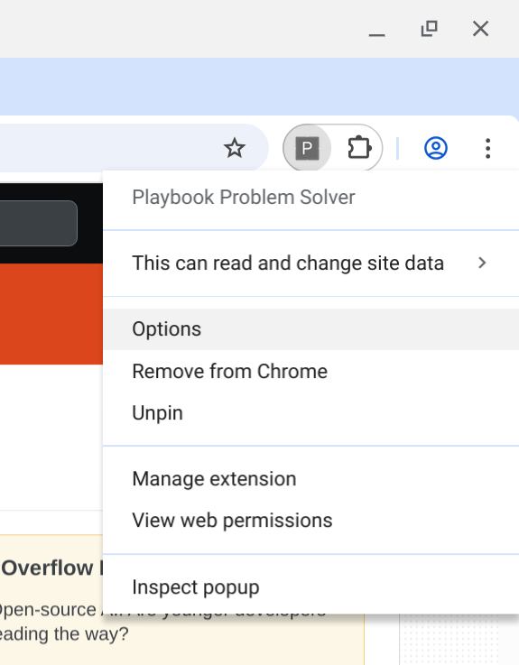

# Playbook Problem Solver - Installation and Configuration Guide

This guide details how to set up the prerequisites, install the extension, and configure it for use.

## Prerequisites

* **Google Chrome Browser:** Required to install and run the extension.
* **Google Account:** Needed for authentication via OAuth 2.0.
* **Google Cloud Platform (GCP) Project:**
    * You need a GCP project to enable APIs and create OAuth credentials.
    * **Billing Enabled:** The Vertex AI API (used for Gemini) is a paid Google Cloud service. Ensure billing is enabled on your GCP project. Be aware of potential costs.
    * **Vertex AI API Enabled:** You must enable the "Vertex AI API" within your GCP project's API Library.

## Setup Instructions

Follow these steps to configure Google Cloud and install the extension:

### Step 1: Google Cloud Project & OAuth Setup

*(Perform these steps in the Google Cloud Console: https://console.cloud.google.com/)*

1.  **Create/Select GCP Project:**
    * Choose an existing project or create a new one.
    * Verify billing is enabled for the project.
2.  **Enable Vertex AI API:**
    * Navigate to "APIs & Services" > "Library".
    * Search for "Vertex AI API".
    * Click on it and ensure it is "Enabled". If not, click "Enable".
3.  **Configure OAuth Consent Screen:**
    * Navigate to "APIs & Services" > "OAuth consent screen".
    * Select User Type: Choose "External" unless all users are within your Google Workspace organization. Click "Create".
    * App Information: Fill in the required fields:
        * App name (e.g., "Playbook Solver Extension")
        * User support email (your email)
        * Developer contact information (your email)
    * Scopes: Click "Add or Remove Scopes". Add the following scopes required by the extension:
        * `https://www.googleapis.com/auth/userinfo.email` (or `openid`)
        * `https://www.googleapis.com/auth/cloud-platform` (grants access to GCP services like Vertex AI)
        * Click "Update" after adding scopes.
    * Test Users: While your app is in "Testing" publishing status, add the Google account email addresses of users who will test the extension.
    * Review the summary and save the consent screen configuration.
4.  **Create OAuth Client ID:**
    * Navigate to "APIs & Services" > "Credentials".
    * Click "+ CREATE CREDENTIALS" at the top and select "OAuth client ID".
    * **Application type:** Choose **"Chrome app"** from the dropdown.
    * **Name:** Give it a descriptive name (e.g., "Playbook Solver Chrome Client").
    * **Application ID:** Leave this blank for now or enter a temporary value if required. You will fill this in accurately after loading the extension in Chrome.
    * Click **"Create"**.
5.  **Copy Client ID:**
    * A "Client ID" will be displayed (e.g., `xxxxxxxxxxxx-xxxxxxxxxxxxxxxxxxxxxxxxxxxxxxxx.apps.googleusercontent.com`).
    * **Copy this Client ID value** – you'll need it for the extension's manifest file.

### Step 2: Extension Installation & Configuration

1.  **Get Extension Code:** Download or clone the extension files (`manifest.json`, `background.js`, `popup.html`, etc.) to a dedicated folder on your computer.
2.  **Update `manifest.json`:**
    * Open the `manifest.json` file in the extension folder using a text editor.
    * Locate the `oauth2` section.
    * Find the `"client_id": "..."` line.
    * **Paste the Client ID** you copied from the Google Cloud Console as the value for `client_id`.
    * Verify the `scopes` listed match those you configured on the GCP consent screen.
    * Save the `manifest.json` file.
3.  **Load the Unpacked Extension in Chrome:**
    * Open Google Chrome.
    * Navigate to the extensions management page: `chrome://extensions`.
    * Enable **"Developer mode"** using the toggle switch, usually located in the top-right corner.
    * Click the **"Load unpacked"** button that appears.
    * In the file dialog, select the **folder** where you saved the extension's files. Click "Select Folder".
    * The "Playbook Problem Solver" extension should now appear in your list of extensions.
4.  **Link Extension ID to GCP Client ID:**
    * On the `chrome://extensions` page, find the newly loaded "Playbook Problem Solver" extension card.
    * Locate its **ID** (a unique string of 32 letters). **Copy this Extension ID.**
    * Return to the **Google Cloud Console** > APIs & Services > Credentials.
    * Click the **pencil icon (Edit)** next to the "Chrome app" Client ID you created earlier.
    * Find the field labeled **"Application ID"**.
    * **Paste the Extension ID** you copied from `chrome://extensions` into this field.
    * Scroll down and click **"Save"** in the GCP Console. This links your specific extension instance to the GCP credentials.
5.  **Configure Extension Options:**
    * Locate the "Playbook Problem Solver" icon in your Chrome toolbar (it might be hidden under the puzzle piece icon – you can pin it).
    * **Right-click** the extension's icon.
    * Select **"Options"** from the context menu. This will open the extension's settings page in a new tab.
    * Enter the following details (as shown below):
        * **Playbook URL (HTML):** The full URL to your HTML playbook document (e.g., `https://.../playbook.html`).
        * **Google Cloud Project ID:** The ID of the GCP project you used for setup (e.g., `your-gcp-project-id`).
    * Click the **"Save Settings"** button.
    * **Options Page Screenshot:**
      

### Step 3: Customization (Essential for HTML Playbooks)

* **Modify `background.js`:** The extension's ability to understand your HTML playbook depends entirely on the JavaScript code within the `extractPlaybookDataFromHtml` function in the `background.js` file.
* **Implement Parsing Logic:** You **must** edit this function and add code using DOM methods (e.g., `doc.querySelectorAll('.myProblemClass')`, `element.textContent`, `table.querySelectorAll('tr > td:nth-child(2)')`) to accurately find and extract the specific problem descriptions, solutions, or relevant rules from the unique HTML structure of *your* playbook file. The provided examples in the comments are starting points only.
* **Test Thoroughly:** After customizing the parsing logic, test the extension with your playbook URL to ensure it extracts the data correctly. Check the background script's console logs for errors or warnings (accessible via the "Service worker" link on the `chrome://extensions` page).

The extension is now installed and configured. You should be able to navigate to a webpage, click the extension icon, and click "Analyze This Page" to initiate the process. Remember to grant consent when prompted by Google the first time.