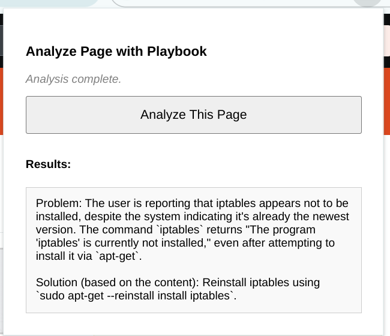

# Playbook Problem Solver - Chrome Extension

## Overview / Purpose

This Chrome extension helps users analyze the content of their current webpage against a predefined "playbook". The playbook, hosted as an HTML document at a specified URL, contains information about potential problems and their corresponding solutions or relevant instructions.

The extension uses Google's Gemini AI (via the Vertex AI API) to understand the context of the current page and compare it against the rules or information extracted from the HTML playbook. It then presents potential problems and solutions found in the extension's popup window.

Authentication with Google Cloud Platform (GCP) is handled securely using OAuth 2.0, leveraging the user's logged-in Chrome session.

## How It Works (Simplified Flow)

1.  **User Action:** The user clicks the extension icon on a webpage they want to analyze.
2.  **Get Page Content:** The popup extracts text from the current page.
3.  **Trigger Analysis:** The popup sends the page content to the background script.
4.  **Authentication:** The background script gets a GCP OAuth token (prompting the user for consent if needed).
5.  **Fetch & Parse Playbook:** The background script fetches the HTML playbook and parses it to extract rules (***requires custom parsing logic***).
6.  **Call Gemini:** The background script sends the page content and extracted playbook data to the Gemini API for analysis.
7.  **Display Results:** The popup displays the analysis received from Gemini.

## Example Usage: Ask Ubuntu iptables

This example demonstrates how you could use an Ask Ubuntu question page (containing installation instructions) as a playbook to analyze another related question page about the program not being installed.

1.  **Set Playbook URL (in Extension Options):**
    * Use the page containing the installation instructions: `https://askubuntu.com/questions/692278/how-to-install-iptables-in-ubuntu`

2.  **Navigate to Problem Page:**
    * Open the page discussing the missing program in Chrome: `https://askubuntu.com/questions/504351/the-program-iptables-is-currently-not-installed`

3.  **Run Analysis:**
    * Click the "Playbook Problem Solver" extension icon in your toolbar.
    * Click the **"Analyze This Page"** button (and grant Google consent if prompted).

4.  **Expected Outcome (with caveats):**
    * The extension popup should display an analysis generated by Gemini.
    * Ideally, Gemini (guided by correctly parsed playbook content) would identify the "iptables not installed" issue and suggest relevant solutions extracted from the playbook page, such as the command `sudo apt-get update && sudo apt-get install iptables`.
    * **Sample Result Screenshot:**
      

5.  **!!! IMPORTANT NOTE ON HTML PARSING !!!**
    * The success of this example (and any use with HTML playbooks) **critically depends** on customizing the **HTML parsing logic** within the `extractPlaybookDataFromHtml` function located in the `background.js` file.
    * The default code has **placeholder logic only**. You **MUST** modify this function to correctly navigate the specific DOM structure of your chosen playbook page (like Ask Ubuntu) and extract the relevant commands, problem descriptions, or solution text.
    * Without this customization, the extension will likely send poor data to Gemini, resulting in weak or irrelevant analysis.